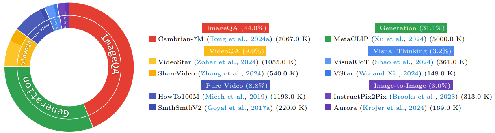

<div align="center">

#   *MetaMorph*:<br>Multimodal Understanding andGeneration via Instruction Tuning


<p>
    
</p>


<a href="https://arxiv.org/abs/2412.14164" target="_blank">
    
</a>
<a href="https://tsb0601.github.io/metamorph/" target="_blank">
    
</a>


<div style="font-family: charter;">
    <a href="https://tsb0601.github.io/petertongsb/" target="_blank">Shengbang Tong¹²*</a>,
    <a href="https://davidfan.io/" target="_blank">David Fan¹</a>,
    <a href="https://jiachenzhu.github.io/" target="_blank">Jiachen Zhu¹²*</a>,
    <a href="https://pages.cs.wisc.edu/~yunyang/" target="_blank">Yunyang Xiong³</a>,
    <a href="https://xinleic.xyz/" target="_blank">Xinlei Chen¹</a>
    <br>
    <a href="https://koustuvsinha.com/" target="_blank">Koustuv Sinha¹</a>,
    <a href="https://ai.meta.com/people/1148536089838617/michael-rabbat/" target="_blank">Michael Rabbat¹</a>,
    <a href="https://yann.lecun.com/" target="_blank">Yann LeCun¹²</a>,
    <a href="https://www.sainingxie.com/" target="_blank">Saining Xie²</a>,
    <a href="https://liuzhuang13.github.io/" target="_blank">Zhuang Liu¹</a>
    <br>
    <br>
    ¹FAIR Meta AI, ²New York University, ³Meta Reality Labs
</div>

</div>
<br>


> 🔥 **Core Discovery**: Visual generation capability *naturally* arises from understanding! With just 200K samples + co-training, LLMs can be taught to generate visual embeddings without extensive pretraining.

### Key Findings in One Shot:
- 🚀 **Understanding <=> Generation**: Better VQA → Better Image Generation, and vice versa!
- 💪 **Efficient**: Co-training unlocks generation with few  samples vs millions needed
- 🧠 **LLM Capability Transfer**: Generate rare concepts like "Chhogori" & solve visual puzzles
- 🎯 **Minor Architectural Changes**: Simple instruction tuning morphs LLM into a unified model

> *Fun fact: MetaMorph is inspired by the biological process of metamorphosis! Transforming a LLM to an Unified Model is just like transforming a caterpillar to a butterfly :)*

## Release
- [04/14/25] 🔥 We released MetaMorph! We also release GPU training scripts.

## Contents
- [Installation](#installation)
- [Model Weights and Play with MetaMorph](#model-weights-and-play-with-metamorph)
- [MetaMorph Instruction Tuning Data](#training-data)
- [Train](#train)
- [Potential Questions & Answers](#potential-questions-and-answers)

## Installation

1. Clone this repository and navigate to into the codebase
```bash
git clone https://github.com/facebookresearch/metamorph
cd metamorph
```

2. Install Packages
```Shell
conda create -n metamorph python=3.11
conda activate metamorph
pip install -e .
```


## Model Weights and Play with MetaMorph

We are still working on open-sourcing the model weights. We wrote a detailed usage guide in [`inference/DEMO.md`](inference/DEMO.md), for those who are able to train MetaMorph in the meantime.

We provide a sample model loading and demo script in [`inference/demo.py`](inference/demo.py). 


## Training Data Breakdown
MetaMorph mostly uses publicly available datasets for training. That said, this repo enables the usage of any data! See below for formatting instructions.
<p align="center">
    
</p>

#### Visual Understanding Data
- **ImageQA**: We use Cambrian-7M from [Tong et al., 2024], a curated collection of publicly available instruction tuning datasets
  ```
  Example:
  Prompt: <image_start><image><image_end> What is the animal in the image?
  Response: It is a burmilla cat.
  ```

- **VideoQA**: Includes VideoStar [Zohar et al., 2024] and ShareVideo [Zhang et al., 2024] datasets, processed at 1 FPS
  ```
  Example:
  Prompt: <image_start><image><image_end> <image_start><image><image_end><image_start><image><image_end> 
  What's the color of the dog in this video? (a) white (b) yellow (c) black Please only answer a single letter and nothing else
  Response: b
  ```

### Visual Generation Data 
- Image-text pairs curated through the MetaCLIP pipeline [Xu et al., 2024]
  - Note: MetaCLIP data is not publicly available, but you can substitute with other public image-text pair datasets or text-to-image datasets such as:
    - CC12M (Conceptual 12M)
    - LAION
    - COYO
  ```
  Example:
  Prompt: Generate an image of a puppy.
  Response: Here is an image based on your request: <image_start><image><image_end>
  ```

#### Additional Visual Data
- **Video Data**: 
  - HowTo100M [Miech et al., 2019]
  - SomethingSomethingV2 [Goyal et al., 2017]
  ```
  Example (Forward Frame Prediction):
  Prompt: <image_start><image><image_end> Can you predict what happens in the next 3 frames, each 5 seconds apart?
  Response: <image_start><image><image_end> <image_start><image><image_end> <image_start><image><image_end>
  ```

- **Visual Thinking Data**: Curated from:
  - Visual CoT [Shao et al., 2024]
  - VStar [Wu and Xie, 2024]
  ```
  Example:
  Prompt: Think visually before you answer the question: what is the color of the hat in the image <image_start><image><image_end>
  Response: Let's consider this visually: <image_start><image><image_end> black.
  ```

- **Image-to-Image Data**:
  - InstructPix2Pix [Brooks et al., 2023]
  - Aurora [Krojer et al., 2024]
  ```
  Example:
  Prompt: <image_start><image><image_end> Make this a rainy day.
  Response: <image_start><image><image_end>
  ```


### Data Format Note
- All examples above show how to format your own data
- `<image_start>` and `<image_end>` are special tokens that indicate the presence of image tokens
- Images are internally processed into visual tokens but shown as `<image>` in the examples for clarity
- Each data sample should be formatted as a conversation with a prompt and response

## Train

This section describes the training process, following the instruction tuning recipe developed in LLaVA-1.5 and Cambrian-1. The training process involves a 2-stage approach:

1. **Pretraining the MLP Connector:** Connects vision and language.
2. **Fine-tuning:** Optimizes both the LLM and the connector together.

We provide a detailed [`training breakdown`](scripts/Train.md) in the linked document. 

### General Notes

- For GPU training with limited resources, you can adjust the `per_device_train_batch_size` and increase `gradient_accumulation_steps` to maintain the global batch size:  
  **Global Batch Size** = `per_device_train_batch_size` × `gradient_accumulation_steps` × `num_gpus`.

### Hyperparameters

The hyperparameters for both pretraining and fine-tuning stages are detailed below.

#### 1. Visual Connector Pretraining

- **Per GPU Batch Size:** 14

| **Base LLM**      | **Global Batch Size** | **Learning Rate** | **Epochs** | **Max Length** |
|--------------------|----------------------:|------------------:|-----------:|---------------:|
| LLaMA-3.1 8B       | 448                  | 3.74e-5            | 1          | 4096           |


#### 2. Instruction Tuning

- **Per GPU Batch Size:** 6

| **Base LLM**      | **Global Batch Size** | **Learning Rate** | **Epochs** | **Max Length** |
|--------------------|----------------------:|------------------:|-----------:|---------------:|
| LLaMA-3.1 8B       | 1536                 | 6.93e-5           | 1          | 4096           |

To train with different batch sizes, use the following formula (from Cambrian-1) to adjust the learning rate:  

Optimal Learning Rate = Base Learning Rate * \sqrt{Batch Size / Base Batch Size}

#### Debugging / non-SLURM Training
For debugging / non-SLURM training, refer to the sample scripts:
`scripts/pretrain_1node.sh`, 
`scripts/finetune_1node.sh`


#### Multi-node SLURM Training

For multi-node training using a SLURM system, refer to the sample script provided:  
`scripts/slurm_train.sh`

### Using Custom Data

To train with other data sources or custom datasets, we support the commonly used LLaVA data format. For handling very large files, we recommend using the JSONL format instead of JSON. This approach optimizes memory usage through lazy data loading.

### Training Visualization

We provide the following resources in the `visualization` folder to help with training visualization:

- **`train.py`**: The main training script.
- **`submit.sh`**: A SLURM submission script for distributed training.
- **`Train_Visualization.md`**: A detailed guide to help you set up and understand the training visualization process.


## Potential Questions and Answers

Here are some questions we received from colleagues and friends, along with their corresponding answers:

**Q: Why is the CFG level used in fine-tuning the diffusion model so high (>0.7)?**

**A:** This is because we start with a *pretrained* diffusion model and aim to transform the conditioning from CLIP text to SigLIP Image. A higher CFG level (e.g., 0.7) ensures the model continues generating high-quality images while gradually adapting to the new conditioning in the remaining fraction (e.g., 0.3). Empirically, this approach yields the best balance in terms of image quality.

---

**Q: Why do you use 64 tokens for one image? Can I use more tokens?**

**A:** Yes, you can use more tokens! We chose 64 tokens to allow training with longer videos. This configuration enables us to include more frames within a limited context length, making it optimal for our use case.

---

**Q: I don’t have access to MetaCLIP data. Can I still train the model?**

**A:** Absolutely! You can substitute MetaCLIP with publicly available image-text datasets such as CC12M, LAION, or COYO. Our method is a general framwork for converting LLMs into unified multimodal models, and does not rely on proprietary datasets. Just make sure that you format the data into the instruction-tuning style pairs as described in the paper.

---

**Q: How many image-text pairs do I need for training?**

**A:** For co-training, good results can be achieved with as few as 200K image-text pairs. However, if you are training solely on generation data without co-training, you may need a larger dataset.

---

**Q: Do I need all the video datasets for training?**

**A:** No, video datasets are not strictly required. They are used to showcase the model’s capabilities. You can start with image-text pairs and ImageQA data, which should suffice for initial training.

---

**Q: Would you open source model weights?**

**A:** We are working on the legal approval process for weights, so stay tuned :)


## Citation

If you find MetaMorph useful for your research and applications, please cite using this BibTeX:
```bibtex
@article{tong2024metamorph,
  title={Metamorph: Multimodal understanding and generation via instruction tuning},
  author={Tong, Shengbang and Fan, David and Zhu, Jiachen and Xiong, Yunyang and Chen, Xinlei and Sinha, Koustuv and Rabbat, Michael and LeCun, Yann and Xie, Saining and Liu, Zhuang},
  journal={arXiv preprint arXiv:2412.14164},
  year={2024}
}
```

## License
The majority of MetaMorph is licensed under CC-BY-NC, however portions of the project are available under separate license terms: Cambrian-1 and LLaVA are licensed under the Apache 2.0 license.

## Acknowledgement

- [LLaVA](https://github.com/haotian-liu/LLaVA): Part of the codebase starts from the amazing LLaVA
- [Cambrian-1](https://cambrian-mllm.github.io/): Part of the code base start from Cambrian-1
- [LLaMA](https://github.com/meta-llama/llama3): We thank LLaMA for continuing contribution to the open-source community and providing LLaMA-3 checkpoints.


## Related Projects
- [Eyes Wide Shut? Exploring the Visual Shortcomings of Multimodal LLMs](https://tsb0601.github.io/mmvp_blog/)
- [Cambrian-1: A Fully Open, Vision-Centric Exploration of Multimodal LLMs](https://cambrian-mllm.github.io/)


